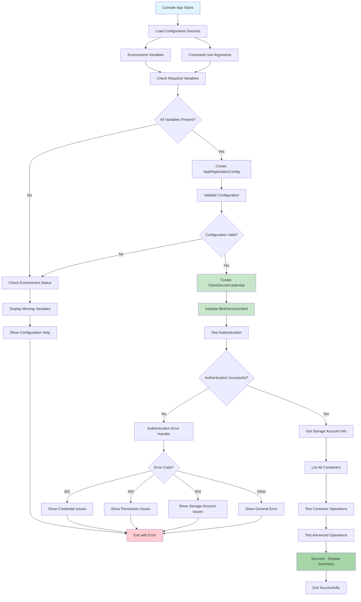
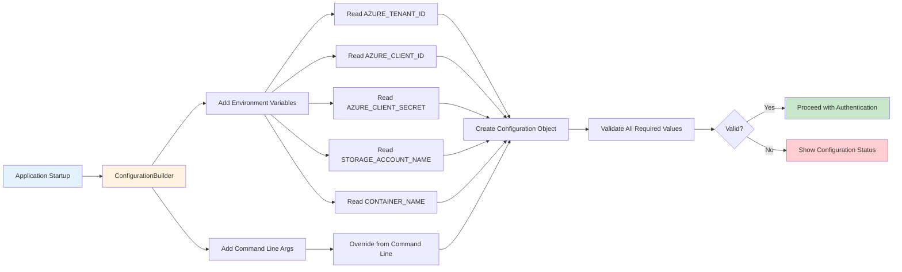
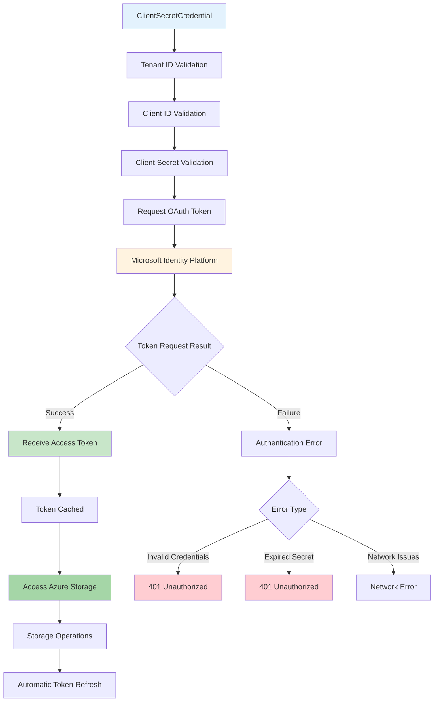
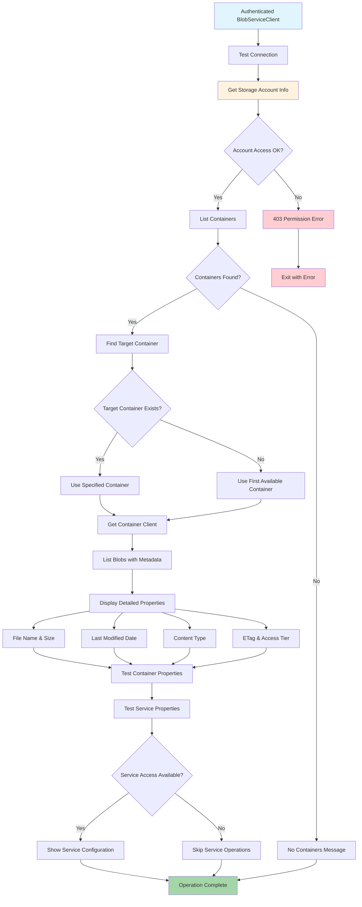
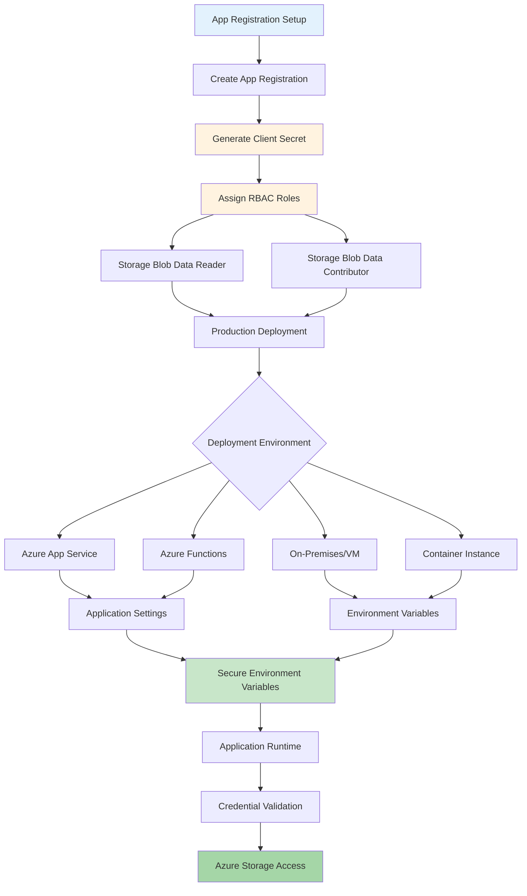

# App Registration Authentication Flow Diagram

```mermaid
flowchart TD
    A[Console App Starts] --> B[Load Configuration Sources]
    
    B --> C[Environment Variables]
    B --> D[Command Line Arguments]
    
    C --> E[Check Required Variables]
    D --> E
    
    E --> F{All Variables Present?}
    F -->|No| G[Check Environment Status]
    F -->|Yes| H[Create AppRegistrationConfig]
    
    G --> I[Display Missing Variables]
    I --> J[Show Configuration Help]
    J --> K[Exit with Error]
    
    H --> L[Validate Configuration]
    L --> M{Configuration Valid?}
    
    M -->|No| G
    M -->|Yes| N[Create ClientSecretCredential]
    
    N --> O[Initialize BlobServiceClient]
    O --> P[Test Authentication]
    
    P --> Q{Authentication Successful?}
    Q -->|No| R[Authentication Error Handler]
    Q -->|Yes| S[Get Storage Account Info]
    
    R --> T{Error Code?}
    T -->|401| U[Show Credential Issues]
    T -->|403| V[Show Permission Issues]
    T -->|404| W[Show Storage Account Issues]
    T -->|Other| X[Show General Error]
    
    U --> K
    V --> K
    W --> K
    X --> K
    
    S --> Y[List All Containers]
    Y --> Z[Test Container Operations]
    Z --> AA[Test Advanced Operations]
    AA --> BB[Success - Display Summary]
    BB --> CC[Exit Successfully]
    
    style A fill:#e1f5fe
    style N fill:#c8e6c9
    style O fill:#c8e6c9
    style BB fill:#a5d6a7
    style K fill:#ffcdd2
```

## Configuration Loading Flow

```mermaid
flowchart LR
    A[Application Startup] --> B[ConfigurationBuilder]
    
    B --> C[Add Environment Variables]
    B --> D[Add Command Line Args]
    
    C --> E[Read AZURE_TENANT_ID]
    C --> F[Read AZURE_CLIENT_ID]
    C --> G[Read AZURE_CLIENT_SECRET]
    C --> H[Read STORAGE_ACCOUNT_NAME]
    C --> I[Read CONTAINER_NAME]
    
    D --> J[Override from Command Line]
    
    E --> K[Create Configuration Object]
    F --> K
    G --> K
    H --> K
    I --> K
    J --> K
    
    K --> L[Validate All Required Values]
    L --> M{Valid?}
    
    M -->|Yes| N[Proceed with Authentication]
    M -->|No| O[Show Configuration Status]
    
    style A fill:#e3f2fd
    style B fill:#fff3e0
    style N fill:#c8e6c9
    style O fill:#ffcdd2
```

## App Registration Authentication Process

```mermaid
flowchart TD
    A[ClientSecretCredential] --> B[Tenant ID Validation]
    B --> C[Client ID Validation]
    C --> D[Client Secret Validation]
    
    D --> E[Request OAuth Token]
    E --> F[Microsoft Identity Platform]
    
    F --> G{Token Request Result}
    G -->|Success| H[Receive Access Token]
    G -->|Failure| I[Authentication Error]
    
    H --> J[Token Cached]
    J --> K[Access Azure Storage]
    
    I --> L{Error Type}
    L -->|Invalid Credentials| M[401 Unauthorized]
    L -->|Expired Secret| N[401 Unauthorized]
    L -->|Network Issues| O[Network Error]
    
    K --> P[Storage Operations]
    P --> Q[Automatic Token Refresh]
    
    style A fill:#e3f2fd
    style F fill:#fff3e0
    style H fill:#c8e6c9
    style K fill:#a5d6a7
    style M fill:#ffcdd2
    style N fill:#ffcdd2
```

## Azure Blob Storage Operations

```mermaid
flowchart TD
    A[Authenticated BlobServiceClient] --> B[Test Connection]
    
    B --> C[Get Storage Account Info]
    C --> D{Account Access OK?}
    
    D -->|No| E[403 Permission Error]
    D -->|Yes| F[List Containers]
    
    F --> G{Containers Found?}
    G -->|No| H[No Containers Message]
    G -->|Yes| I[Find Target Container]
    
    I --> J{Target Container Exists?}
    J -->|Yes| K[Use Specified Container]
    J -->|No| L[Use First Available Container]
    
    K --> M[Get Container Client]
    L --> M
    
    M --> N[List Blobs with Metadata]
    N --> O[Display Detailed Properties]
    
    O --> P[File Name & Size]
    O --> Q[Last Modified Date]
    O --> R[Content Type]
    O --> S[ETag & Access Tier]
    
    P --> T[Test Container Properties]
    Q --> T
    R --> T
    S --> T
    
    T --> U[Test Service Properties]
    U --> V{Service Access Available?}
    
    V -->|Yes| W[Show Service Configuration]
    V -->|No| X[Skip Service Operations]
    
    W --> Y[Operation Complete]
    X --> Y
    H --> Y
    E --> Z[Exit with Error]
    
    style A fill:#e1f5fe
    style C fill:#fff3e0
    style Y fill:#a5d6a7
    style E fill:#ffcdd2
    style Z fill:#ffcdd2
```

## Security and Deployment Flow

```mermaid
flowchart TD
    A[App Registration Setup] --> B[Create App Registration]
    B --> C[Generate Client Secret]
    C --> D[Assign RBAC Roles]
    
    D --> E[Storage Blob Data Reader]
    D --> F[Storage Blob Data Contributor]
    
    E --> G[Production Deployment]
    F --> G
    
    G --> H{Deployment Environment}
    
    H --> I[Azure App Service]
    H --> J[Azure Functions]
    H --> K[On-Premises/VM]
    H --> L[Container Instance]
    
    I --> M[Application Settings]
    J --> M
    K --> N[Environment Variables]
    L --> N
    
    M --> O[Secure Environment Variables]
    N --> O
    
    O --> P[Application Runtime]
    P --> Q[Credential Validation]
    Q --> R[Azure Storage Access]
    
    style A fill:#e3f2fd
    style C fill:#fff3e0
    style D fill:#fff3e0
    style O fill:#c8e6c9
    style R fill:#a5d6a7
```