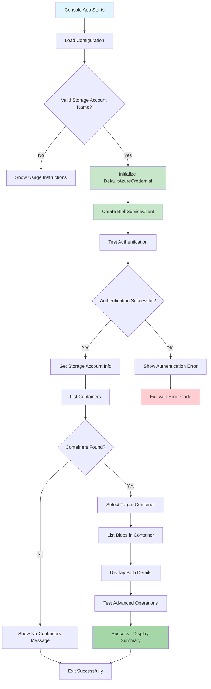
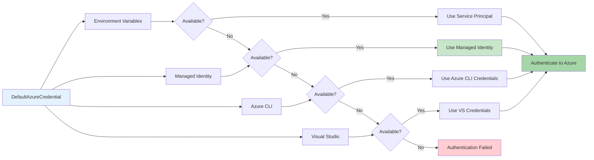
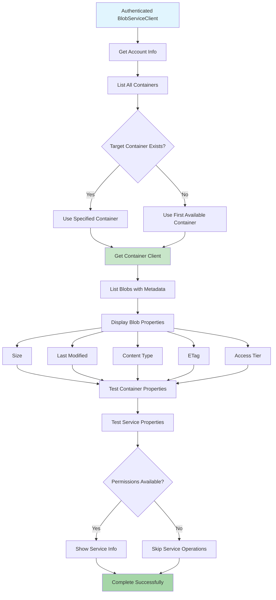
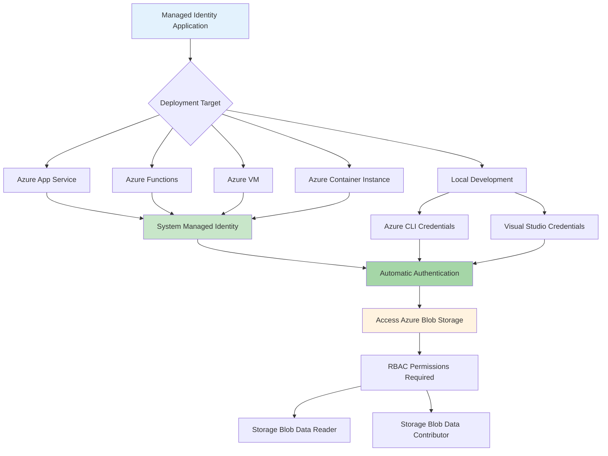

# Managed Identity Authentication Flow Diagram

```mermaid
flowchart TD
    A[Console App Starts] --> B[Load Configuration]
    B --> C{Valid Storage Account Name?}
    
    C -->|No| D[Show Usage Instructions]
    C -->|Yes| E[Initialize DefaultAzureCredential]
    
    E --> F[Create BlobServiceClient]
    F --> G[Test Authentication]
    
    G --> H{Authentication Successful?}
    H -->|No| I[Show Authentication Error]
    H -->|Yes| J[Get Storage Account Info]
    
    J --> K[List Containers]
    K --> L{Containers Found?}
    
    L -->|No| M[Show No Containers Message]
    L -->|Yes| N[Select Target Container]
    
    N --> O[List Blobs in Container]
    O --> P[Display Blob Details]
    P --> Q[Test Advanced Operations]
    Q --> R[Success - Display Summary]
    
    I --> S[Exit with Error Code]
    M --> T[Exit Successfully]
    R --> T
    
    style A fill:#e1f5fe
    style E fill:#c8e6c9
    style F fill:#c8e6c9
    style R fill:#a5d6a7
    style S fill:#ffcdd2
```

## Authentication Methods (DefaultAzureCredential Chain)

```mermaid
flowchart LR
    A[DefaultAzureCredential] --> B[Environment Variables]
    A --> C[Managed Identity]
    A --> D[Azure CLI]
    A --> E[Visual Studio]
    
    B --> F{Available?}
    C --> G{Available?}
    D --> H{Available?}
    E --> I{Available?}
    
    F -->|Yes| J[Use Service Principal]
    F -->|No| G
    
    G -->|Yes| K[Use Managed Identity]
    G -->|No| H
    
    H -->|Yes| L[Use Azure CLI Credentials]
    H -->|No| I
    
    I -->|Yes| M[Use VS Credentials]
    I -->|No| N[Authentication Failed]
    
    J --> O[Authenticate to Azure]
    K --> O
    L --> O
    M --> O
    
    style A fill:#e3f2fd
    style K fill:#c8e6c9
    style O fill:#a5d6a7
    style N fill:#ffcdd2
```

## Azure Blob Storage Operations Flow

```mermaid
flowchart TD
    A[Authenticated BlobServiceClient] --> B[Get Account Info]
    B --> C[List All Containers]
    
    C --> D{Target Container Exists?}
    D -->|Yes| E[Use Specified Container]
    D -->|No| F[Use First Available Container]
    
    E --> G[Get Container Client]
    F --> G
    
    G --> H[List Blobs with Metadata]
    H --> I[Display Blob Properties]
    
    I --> J[Size]
    I --> K[Last Modified]
    I --> L[Content Type]
    I --> M[ETag]
    I --> N[Access Tier]
    
    J --> O[Test Container Properties]
    K --> O
    L --> O
    M --> O
    N --> O
    
    O --> P[Test Service Properties]
    P --> Q{Permissions Available?}
    
    Q -->|Yes| R[Show Service Info]
    Q -->|No| S[Skip Service Operations]
    
    R --> T[Complete Successfully]
    S --> T
    
    style A fill:#e1f5fe
    style G fill:#c8e6c9
    style T fill:#a5d6a7
```

## Deployment Scenarios

```mermaid
flowchart TD
    A[Managed Identity Application] --> B{Deployment Target}
    
    B --> C[Azure App Service]
    B --> D[Azure Functions]
    B --> E[Azure VM]
    B --> F[Azure Container Instance]
    B --> G[Local Development]
    
    C --> H[System Managed Identity]
    D --> H
    E --> H
    F --> H
    
    G --> I[Azure CLI Credentials]
    G --> J[Visual Studio Credentials]
    
    H --> K[Automatic Authentication]
    I --> K
    J --> K
    
    K --> L[Access Azure Blob Storage]
    L --> M[RBAC Permissions Required]
    
    M --> N[Storage Blob Data Reader]
    M --> O[Storage Blob Data Contributor]
    
    style A fill:#e3f2fd
    style H fill:#c8e6c9
    style K fill:#a5d6a7
    style L fill:#fff3e0
```